[지난번 포스트](https://blog.ny64.kr/posts/install-proxmox-on-home-server/)에서 Proxmox를 설치하고 기본 설정을 했었습니다.

이번 포스트에서는 VM을 생성해보겠습니다.

## ISO 파일 다운로드

VM을 생성하기 전에 먼저 ISO 파일을 다운로드 받아줍시다.

저는 Ubuntu 22.04.3 LTS를 설치할 예정이므로 [Ubuntu 카카오 미러](https://mirror.kakao.com/ubuntu-releases/)에서 ISO 파일의 다운로드 링크를 복사해줍니다.

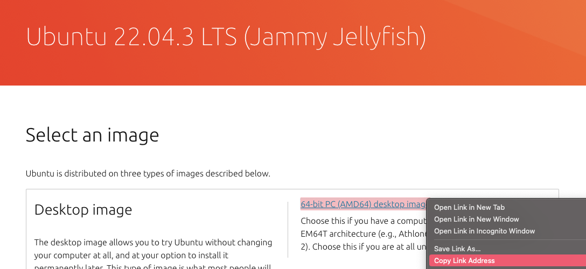

Proxmox의 왼쪽 메뉴에서 `local`을 선택하고, `ISO Images` 탭으로 이동합니다.

상단의 `Download from URL` 버튼을 누른 뒤, 방금 복사한 링크를 붙여넣어 줍니다. `Query URL` 버튼을 누른 뒤 `Download` 버튼을 눌러주면 다운로드가 시작됩니다.

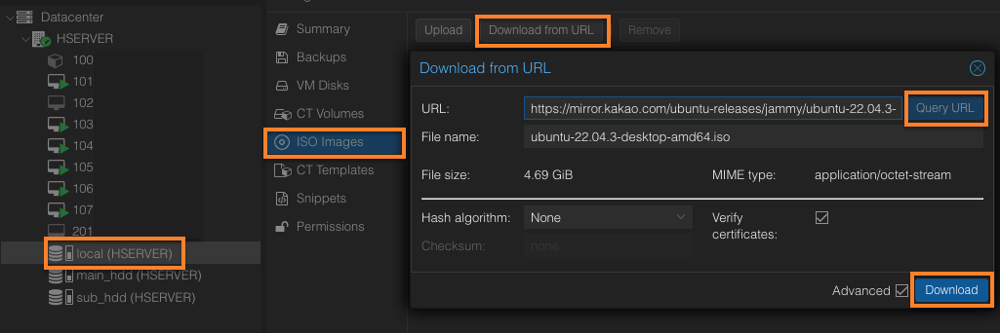

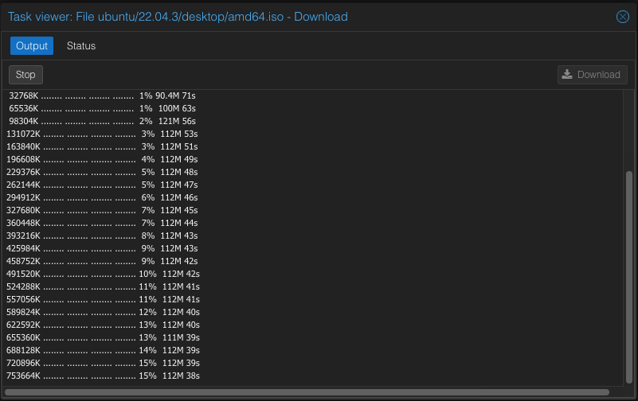

## VM 생성

오른쪽 상단의 `Create VM` 버튼을 눌러줍니다.

### 기본 설정

이름을 입력해주고 Proxmox가 부팅되면 자동으로 시작되도록 `Start at boot`를 체크해줍니다.

이 옵션이 보이지 않는다면 하단의 `Advanced`를 체크해주세요.

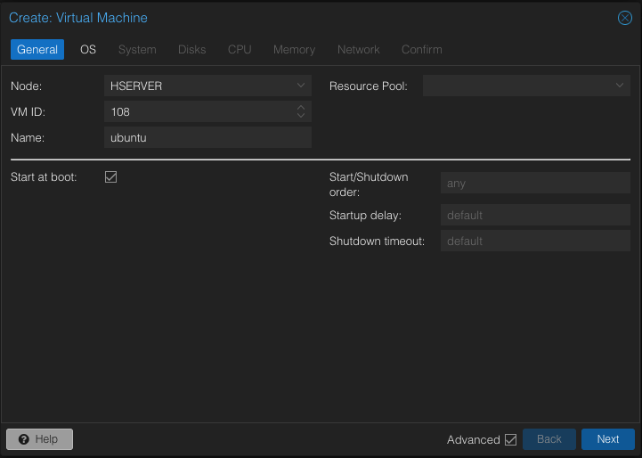

### OS 설정

다운로드한 ISO 파일을 선택해줍니다.

OS Type은 기본값인 `Linux`로 커널 버전은 `6.x`로 선택해주세요.

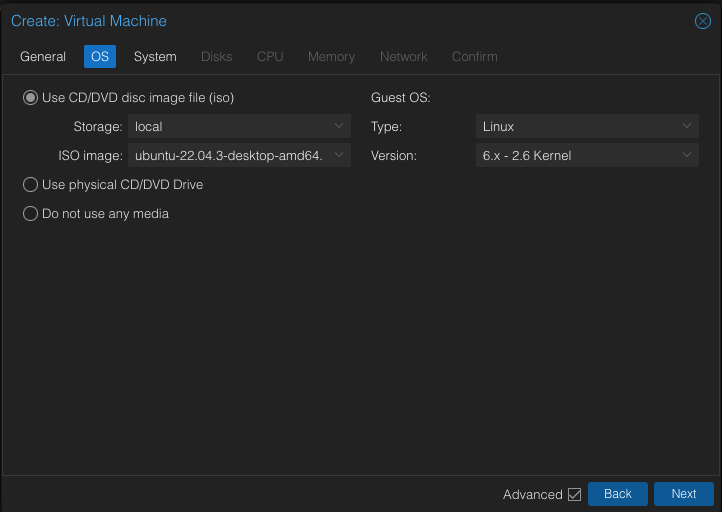

### 시스템 설정

이 부분은 딱히 건드릴 것이 없습니다.
기본값 그대로 두고 다음으로 넘어가주세요.

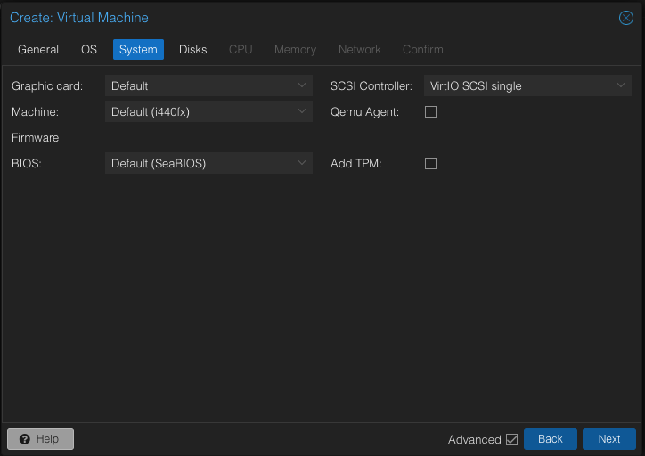

### 디스크 설정

저는 기본 디스크 크기인 32GB로 설정하겠습니다.

Cache는 `Write back`으로 설정해줍니다.

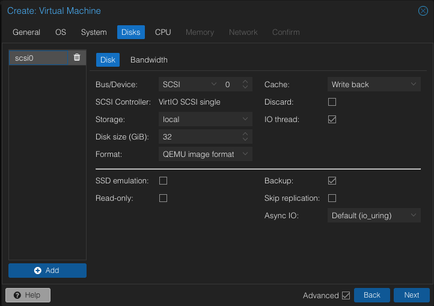

### CPU 설정

사용할 CPU 코어의 개수를 설정해줍니다.

저는 4코어로 설정하겠습니다.

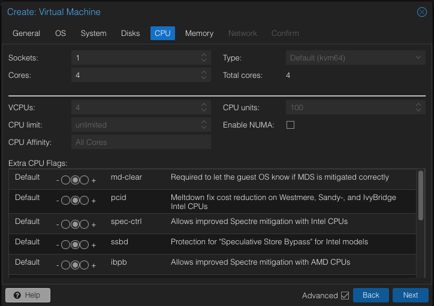

### 메모리 설정

사용할 메모리의 양을 설정해줍니다.

저는 2GB로 설정하겠습니다.

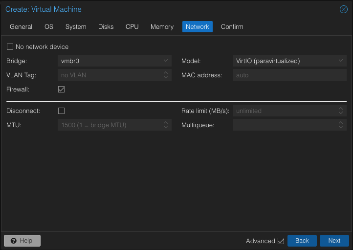

### 네트워크 설정

특별한 일이 없다면 기본값 그대로 두고 다음으로 넘어가주세요.

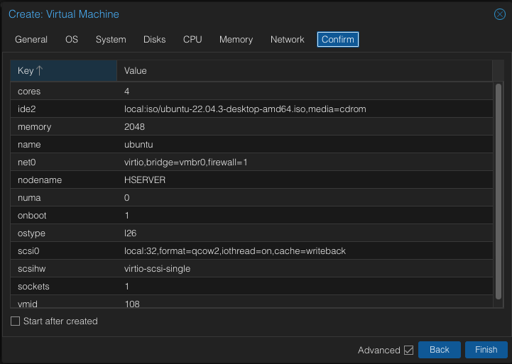

마지막으로 설정한 내용이 정확한지 확인해주고 `Finish` 버튼을 눌러줍니다.

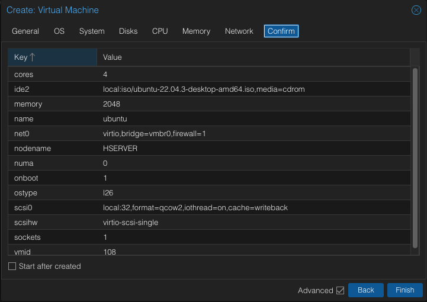

## VM 실행

생성한 VM을 선택하고 오른쪽 상단의 `Start` 버튼을 눌러 VM을 실행할 수 있습니다.

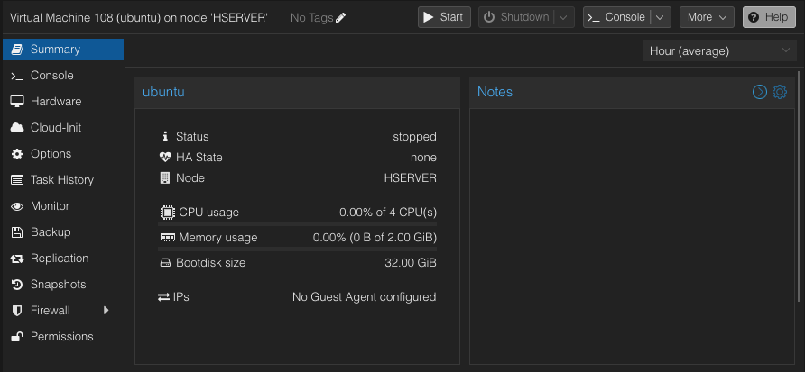
