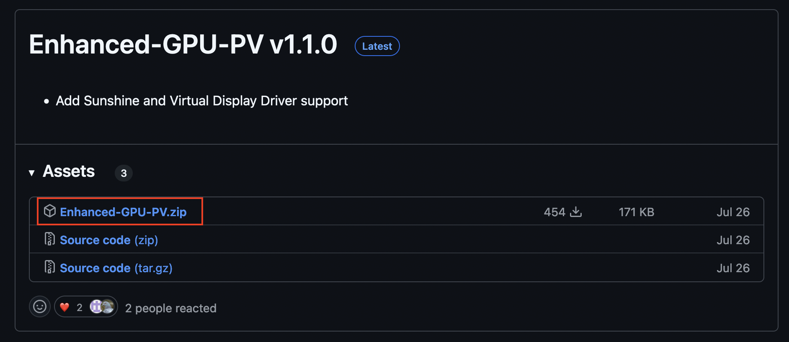
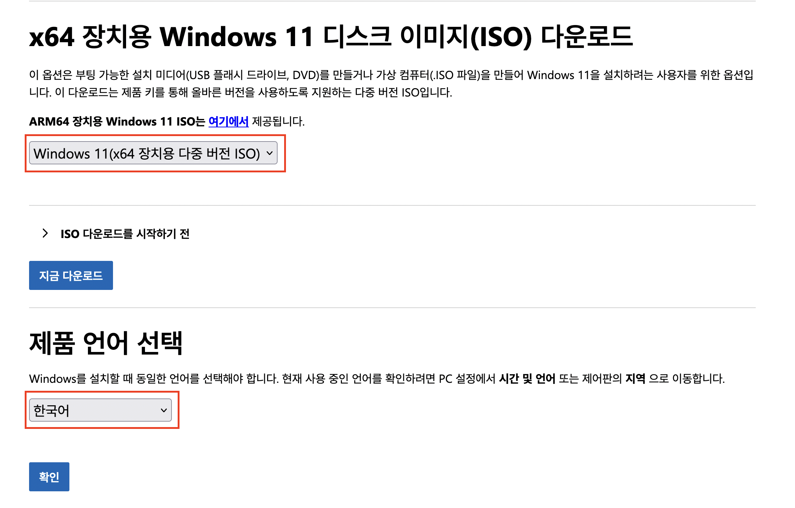
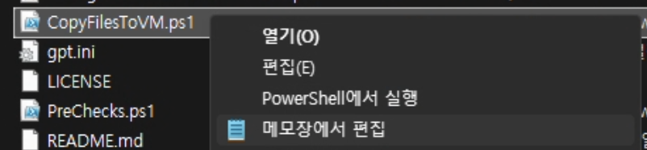
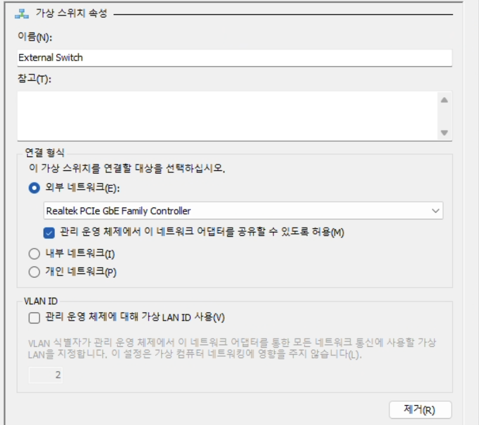
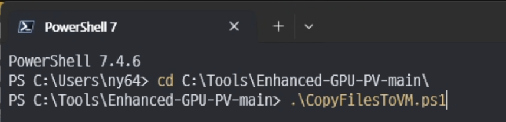

Windows에는 내부적으로 WSL2 및 Sandbox에서 사용하는 GPU-PV라는 기술이 있습니다.

GPU-PV를 사용하면 Hyper-V 윈도우 게스트에서 호스트의 GPU를 일정 부분 나눠서 할당해 줄 수 있습니다.

호스트 GPU의 PCIe 장치 전체를 할당하는 것이 아니라 특정 퍼센트 만큼 자원을 나눠 사용하는 방식이라 간단하고, iGPU 또한 사용할 수 있습니다.

## 요구 사항

-   Windows 10 20H1 이상 (Pro, Enterprise, Education) 또는 Windows 11 이상 (Pro, Enterprise, Education) 버전
-   호스트와 Hyper-V 게스트 간의 윈도우 버전이 동일해야 함
-   Nvidia, AMD 또는 Intel iGPU (Nvidia Laptop GPU는 지원하지 않음)
-   GPU가 하드웨어 디코딩 지원 (NVIDIA NVENC, Intel Quicksync 또는 AMD AMF)
-   Windows 내장 GPU 드라이버가 아닌 제조사의 최신 GPU 드라이버가 설치되어 있어야 함
-   호스트의 Windows와 동일한 버전의 Windows iSO 파일 (미디어 생성 도구를 사용하면 안 됨)
-   Hyper-V 활성화 및 메인보드의 가상화 기능(VT-d, AMD-Vi)이 활성화되어 있어야 함

## 설정 방법

우리는 GPU-PV 기술을 보다 사용하기 편하게 만들어져 있는 [timminator/Enhanced-GPU-PV](https://github.com/timminator/Enhanced-GPU-PV) 프로젝트를 사용할 것입니다.

### 레포지토리 다운로드

[릴리즈 페이지](https://github.com/timminator/Enhanced-GPU-PV/releases)에서 최신 버전의 Enhanced-GPU-PV를 다운로드 받습니다.



다운로드 받은 파일을 압축 해제해 줍니다.

### 윈도우 iSO 파일 다운로드

GPU-PV를 사용하기 위해서는 호스트와 게스트의 윈도우 버전이 동일해야 합니다. (에디션은 동일할 필요 없음)

[여기](https://www.microsoft.com/ko-kr/software-download/windows10)에서 윈도우 10 또는 [여기](https://www.microsoft.com/ko-kr/software-download/windows11)에서 윈도우 11을 다운로드 받습니다.

이 때 'Windows 11 설치 미디어 만들기'를 사용하면 안 됩니다. 하단의 'x64 장치용 Windows 11 다운로드'를 클릭하여 iSO 파일을 다운로드 받습니다.



### Hyper-V 게스트 생성

앞서 다운받았던 `Enhanced-GPU-PV.zip` 파일을 압축 해제한 폴더로 이동합니다.

해당 폴더 안에 있는 `CopyFilesToVM.ps1` 파일을 수정합니다.



첫 부팅시 인터넷 연결이 필요하므로 네트워크 스위치를 먼저 설정해 줘야 합니다.

Hyper-V 관리자를 열고 좌측의 '가상 스위치 관리자'를 클릭합니다.

'새 가상 네트워크 스위치'를 클릭하고 '외부 네트워크'를 선택하여 네트워크 스위치를 생성합니다.

이름은 대충 `External Switch`로 설정하고 호스트의 네트워크 어댑터를 선택합니다.



파일을 열어 주석을 참고하며 아래와 유사하게 수정해 줍니다.

`NetworkSwitch`는 방금 생성한 네트워크 스위치의 이름을 입력해 주면 됩니다.

`GPUResourceAllocationPercentage`의 10은 GPU 자원을 10% 할당한다는 의미입니다.

```powershell
$params = @{
    VMName = "GPUPV" # Hyper-V VM 이름
    SourcePath = "D:\Downloads\Windows11.iso" # 윈도우 iSO 파일 경로
    Edition    = 6 # 6은 Windows Pro를 의미함
    VhdFormat  = "VHDX"
    DiskLayout = "UEFI"
    SizeBytes  = 128GB # 가상 디스크 크기
    MemoryAmount = 8GB # 메모리 크기
    CPUCores = 4
    # Make sure your specified switch is configured for the external network. A internet connection is required on the first boot.
    NetworkSwitch = "External Switch" # 사용할 네트워크 스위치 이름
    VHDPath = "F:\Virtual Hard Disks" # 가상 디스크를 저장할 경로
    UnattendPath = "$PSScriptRoot"+"\autounattend.xml"
    GPUName = "AUTO"
    GPUResourceAllocationPercentage = 10 # GPU 자원 할당 퍼센트

    # Valid combinations are:
    # 1. All four false (just a machine with GPU-PV support)
    # 2. Parsec + ParsecVDA
    # 3. Parsec + Virtual-Display-Driver (with or without HDR support depending on the build version of your specified ISO)
    # 4. Sunshine + Virtual-Display-Driver (with or without HDR support depending on the build version of your specified ISO)
    # 5. Sunshine + ParsecVDA
    Parsec = $true
    ParsecVDA = $false
    Sunshine = $false
    VirtualDisplayDriver = $true

    Team_ID = ""
    Key = ""
    Username = "test" # 윈도우 계정 이름
    Password = "q1w2e3r4" # 윈도우 계정 비밀번호
    Autologon = "true" # 자동 로그인 여부
}
```

파일을 모두 수정했다면 저장한 뒤 해당 폴더에서 PowerShell을 **관리자 권한으로 실행**한 뒤 스크립트를 실행합니다.

```powershell
.\CopyFilesToVM.ps1
```



조금 기다리면 Hyper-V 관리자에 새로운 VM이 생성되고 자동으로 부팅됩니다.

부팅이 완료된 뒤 윈도우 바탕화면이 나왔다면, 사전 설치돼있는 Parsec을 열어 로그인합니다.

그런 다음 바탕화면의 `Switch Display to Virtual Display` 바로 가기를 실행합니다.

이제 Parsec을 통해 VM에 접속할 수 있습니다.

## 참고 자료

-   [jamesstringerparsec/Easy-GPU-PV](https://github.com/jamesstringerparsec/Easy-GPU-PV)
-   [timminator/Enhanced-GPU-PV](https://github.com/timminator/Enhanced-GPU-PV)
