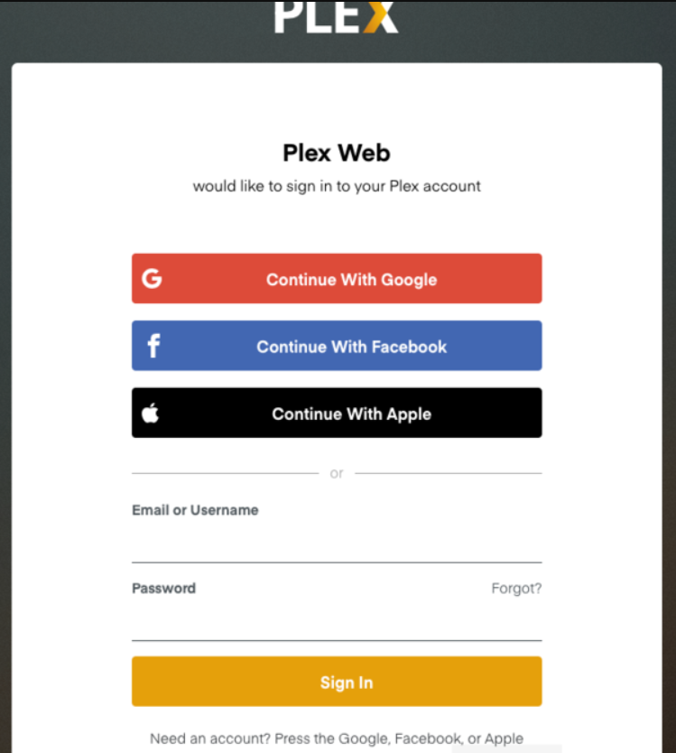
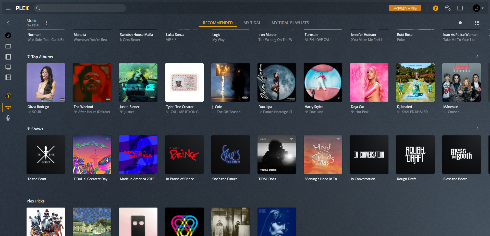
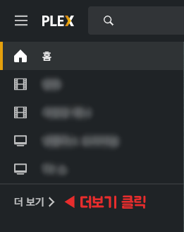
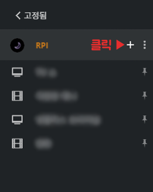
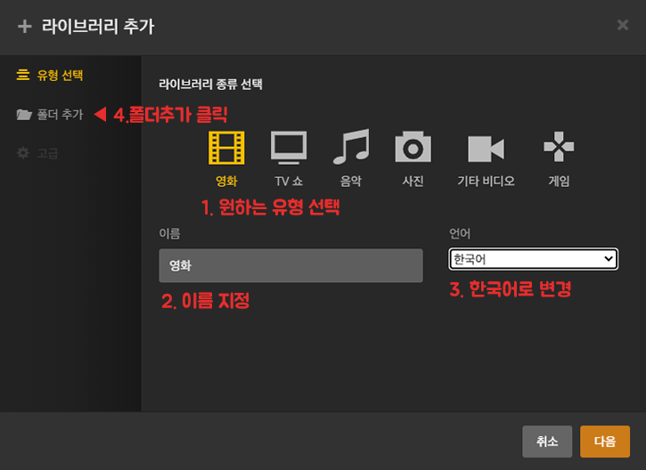
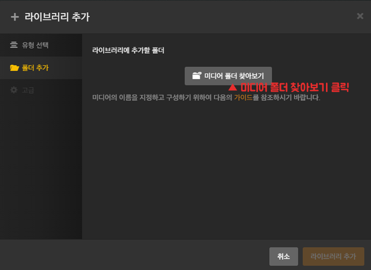
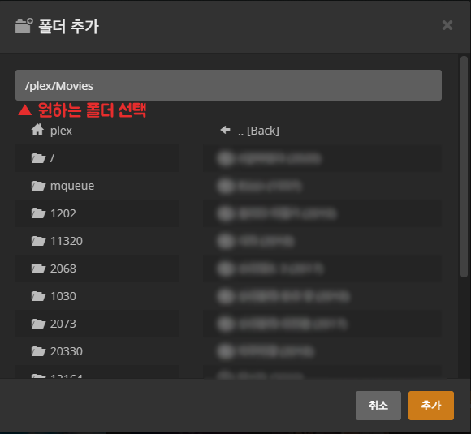
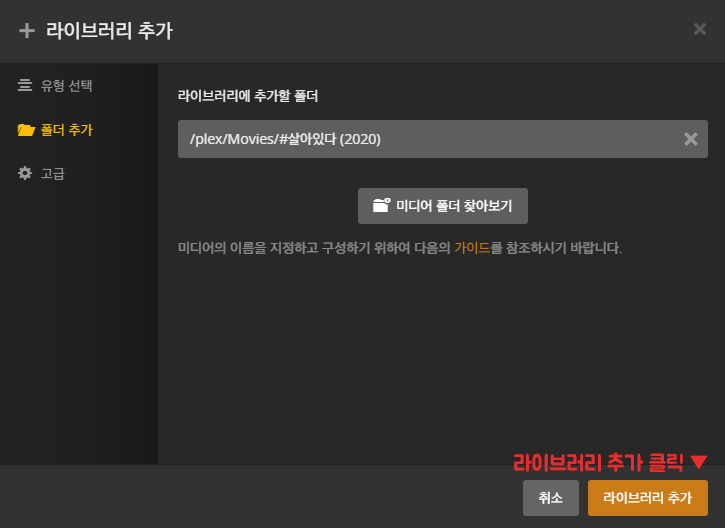
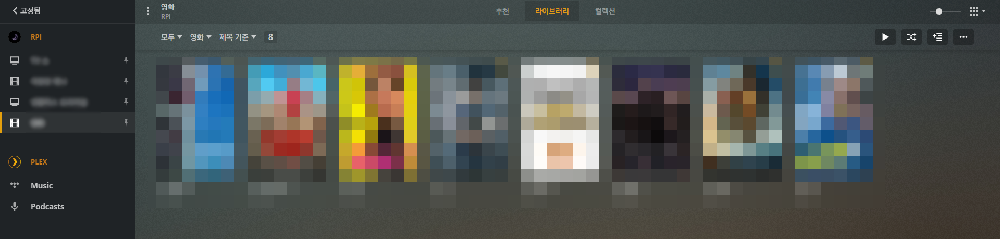

이번 포스트에서는 라즈베리파이에 미디어 서버를 구축해

언제 어디서나 인터넷만 연결돼있으면 쉽고 편리하게 미디어를 감상할 수 있게 만들어 보겠습니다.

## Plex Media Server?

미디어 서버는 저장된 미디어를 스트리밍으로 볼 수 있게 해주는 서버입니다.

라즈베리파이에 설치할 수 있는 미디어 서버는 다양하지만 오늘은 가장 인기 있고, 사용하기 편한 미디어 서버 중 하나인 **플렉스 미디어 서버**를 설치해볼 예정입니다

FHD로 원활하게 영상을 스트리밍하기 위해서는 라즈베리파이4 이상을 권장합니다.

## 설치하기

일단 업데이트/업그레이드 부터!

```sh
sudo apt-get update
sudo apt-get upgrade
```

`Repository`를 추가합니다.

```sh
sudo apt-get install apt-transport-https

curl https://downloads.plex.tv/plex-keys/PlexSign.key | sudo apt-key add -

echo deb https://downloads.plex.tv/repo/deb public main | sudo tee /etc/apt/sources.list.d/plexmediaserver.list
```

`Repository list`를 업데이트하고, Plex Media Server를 설치합니다.

```sh
sudo apt-get update

sudo apt-get install plexmediaserver -y
```

만약 이런 경고가 나온다면, `systemctl daemon-reload`를 실행해 줍시다.

```
Warning: The unit file, source configuration file or drop-ins of plexmediaserver.
service changed on disk. Run 'systemctl daemon-reload' to reload units.
```

## 접속하기

설치가 성공적으로 완료되었다면, 이제 접속해볼까요?

`ifconfig`등으로 라즈베리파이의 IP주소를 확인한 뒤 `http://IP:32400/web`으로 접속합니다.



이런 화면이 나오면 성공입니다.

위와 같이 **구글, 페이스북, 애플 계정**으로 연동하셔도 되고, 아니면 밑에 **sign up with email**을 눌러 회원가입을 하셔도 됩니다.

로그인해보면 해보면 아래와 같은 화면이 뜹니다.



여기 나오는 **영화, 뉴스, 팟캐스트** 등은 플렉스에서 기본으로 제공 해주는 미디어 들입니다.

## USB마운트

리눅스에서는 USB를 연결하면 바로 사용할 수 있는게 아니라 직접 사용하고 싶은 폴더에 마운트 해줘야 합니다.

USB를 연결하고,
`fdisk`명령어로 파티션 목록을 확인합니다.

```sh
sudo fdisk -l
```

제일 아래 줄을 보면 64GB USB가 `/dev/sda1`에 할당되어 있다는 것을 확인 할 수 있습니다.

```sh
Device     Boot Start       End   Sectors  Size Id Type
/dev/sda1        2048 120174591 120172544 57.3G  7 HPFS/NTFS/exFAT
```

USB를 마운트 하기 위해서는 마운트를 할 폴더를 하나 만들어야 합니다.

폴더의 위치와 이름은 상관없지만, 저는 편의를 위해서 루트 폴더에 **plex**라는 폴더를 만들겠습니다.

```sh
sudo mkdir /plex
```

이제 이 폴더에 USB를 마운트하기 위해 아래와 같이 입력합니다.

```sh
sudo mount -t auto /dev/sda1 /plex
```

만약 이렇게 했는데 USB의 파일시스템이 NTFS라서 오류가 날 경우 아래와 같이 `ntfs-3g`패키지를 설치한 다음 마운트해주면 됩니다.

```sh
sudo apt-get install ntfs-3g
```

라즈베리파이를 재부팅 해도 자동으로 USB가 마운트 되도록 `/etc/fstab`를 수정해 줍시다.

```sh
sudo nano /etc/fstab
```

그리고 제일 하단에 아래와 같이 한 줄을 추가합니다.

```sh
/dev/sda1 /plex auto defaults 0 0
```

그럼 아래와 같이 마운트한 폴더에 영화들이 잘 나오는 것을 확인할 수 있습니다.

```sh
NY@RPI:~$ ls -al /plex/
total 1156
drwxr-xr-x 10 root root 131072 Jul 19 20:10  .
drwxr-xr-x 22 root root   4096 Jul  1 19:31  ..
drwxr-xr-x  7 root root 131072 May 29 11:15 'Animated Film'
drwxr-xr-x  2 root root 131072 May 29 04:10  Animation
drwxr-xr-x  5 root root 131072 May 29 11:15 'Ghibli Movies'
drwxr-xr-x 11 root root 131072 Jun 12 21:37  Movies
drwxr-xr-x  3 root root 131072 May 29 11:38 'TV Shows'
```

## Plex 설정하기

이제 다시 브라우저로 돌아와 마운트한 USB를 라이브러리로 추가해 줍시다.

왼쪽 위 메뉴에서 **더보기**를 클릭한 후


**플러스 버튼**을 클릭


라이브러리 추가 창에서 원하는 **유형, 언어, 이름**을 설정하고 **폴더추가 버튼**을 누릅니다.


**미디어 폴더 찾아보기**를 클릭한 다음


**원하는 폴더(마운트한 폴더)** 를 선택하고


**라이브러리 추가**를 클릭해 라이브러리에 추가합니다.


그럼 아래 사진처럼 USB안에 있었던 영화들이 정리되어 표시되는걸 확인할 수 있습니다.


---

> 플렉스를 미디어 서버로 활용할 때의 큰 장점은 미디어 서버를 구축해 놓은 뒤에 친구나 가족들과 자신이 가진 미디어를 공유할 수 있다는 점입니다.

> 또 다른 장점은 클라이언트 프로그램이 다양한 플랫폼에서 지원된다는 점입니다. 데스크톱은 물론이고 안드로이드를 사용한 TV나 핸드폰 등에서도 인터넷만 가능하다면 영상을 어디서나 시청 할 수 있습니다.

**플렉스**에 대한 더 자세한 사용법은 **[여기](https://www.plex.tv/)** 를 참고하시길 바랍니다.
