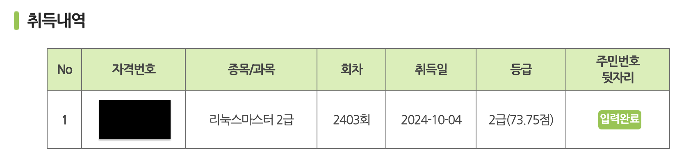
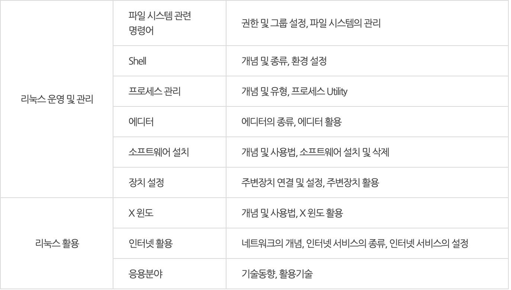

사실 작년 10월에 취득하긴 했으나 귀찮아서 미루다 이제야 후기 글을 작성해 본다.

본인은 고등학교 3학년(취득일 기준 2학년)에 2403회 시험을 응시하였다. 딱히 자격증이 필수로 필요한 상황은 아니었지만, 재미로 응시한 시험이었다. 합격 후 나중에 알아보니 학점은행제에서 5학점을 인정해 준다고 한다.

1차와 2차 모두 100점 만점에 60점 이상 취득 시 합격이다. 2024년도 기준 합격률은 25.82%라고 한다.

## 1차 필기

1차는 시험은 온라인으로 이루어진다. 시험 접수 후 다음 날 13시 이후부터 응시할 수 있다. 형식상 보는 시험이라고 해도 과언이 아닐 정도로 별것 없다. 다른 온라인 시험들처럼 카메라, 마이크와 화면 녹화 등의 장치가 전혀 없으므로 사실상 오픈북 시험이라고 해도 된다. 문재 은행식으로 출제되기 때문에 족보 두세 개 펼쳐두고 문제에 나온 키워드로만 검색하면 동일한 문제가 나온다. 50문항에 60분이 주어지기 때문에 살짝이라도 공부했다면 넉넉할 것이다. 하나도 공부를 안 한 상태에서 족보와 구글링 등으로 푼다면 부족할 수도 있다.

## 2차 실기

실기라고 하지만 오프라인 시험장에서 보는 필기시험이다. 1차와 달리 진짜 시험이라고 보면 된다. 객관식 사지선다 OMR 시험이다.

리눅스 운영 및 관리 48문제, 리눅스 활용 32문제로 이루어져 있다. 한 문제당 1.25점으로 48문제 이상을 맞춰야 한다. 시험 시간은 총 100분이 주어져서 부족하다고 느껴지지는 않았다.

평소에도 리눅스를 사용하기도 하였고 기초 지식이 어느 정도 있는 상황이어서 그러진 모르겠으나 다시 과거로 돌아간다면 굳이 교재를 구매해서 공부하지는 않을 것 같다. <이기적 리눅스마스터 2급 기본서>를 구매했었지만, 한두 번 전체적으로 훑어본 뒤로는 방구석에 처박아 뒀었다,,

다른 여러 후기 글에서 말하듯이 개념 위주로 외우지만 말고, 어느정도 개념이 익혀졌으면 [CBT](https://www.comcbt.com/)를 많이 풀어보는 게 많은 도움이 됐었던 것 같다.

### 공부 방법

앞서 말했지만 일단 본인은 리눅스에 대한 기초 지식이 이미 있는 상황이었다. 교재에 있는 개념들 위주로만 한두 번 빠르게 정독한 뒤 그 뒤로는 CBT만 무한정 돌렸었다. 최소 과거 10회차까지의 기출문제들은 다 풀어봤던 것 같다. 블로그 등에 정리된 개념 PDF도 많은 도움이 되었었다.

공부 중 유용하게 사용했던 인공지능 모의고사 기능이다. [COMCBT](https://www.comcbt.com/) 사이트에서 로그인 후 문제를 풀면 틀린 문제의 유형들 위주로 나만을 위한 모의고사 문제를 만들어주는 기능이다. 그래도 모르겠는 유형들과 헷갈리는 생소한 명령어 들은 따로 노션에 정리해서 지하철에서 아침마다 공부했었다.

노션에 정리했던 개념 중 일부이다. SetUID, SetGID등 리눅스를 사용해 봤더라도 흔히 사용하지 않는 특수 권한들과 표준 관련 용어들을 외우는 데 좀 어려웠었다. _(EIA는 LAN **케이블** 관련 표준 / IEEE는 LAN 관련 표준 등등)_

2024년 9월 9일 접수 후 약 한 달 남짓의 시간이 있었지만 9월달에 해커톤도 참여했었고, 학교 프로젝트 마감 기간과도 겹쳐 실제로 공부한 시간은 1주에서 2주 사이 정도였었다.

## 시험 당일

시험 당일에는 노션에 정리해 둔 개념들 위주로만 복습했다. 서브넷 마스크 계산 문제가 한 문제 출제되었지만, 일부러 공부하지 않는 내용이라 과감하게 패스하였다. 기출 문제들을 보면 서브넷 마스크 계산 문제가 많아봤자 두 문제 나오는 수준이라 네트워크 비전공자인 나에게는 차라리 그 시간에 다른 개념들을 공부하는 것이 더 낫다고 생각했었다. 60점에 간당간당한 수준이 아니라면 굳이 공부하지 않아도 될 것 같기는 하다.

시험 시간은 100분으로 다 풀고 검토까지 하고 나서도 시간이 10분 정도 남았었다. 감독관과 시험장마다 다르겠지만 나의 경우 수험표 뒷면에 답안을 적어 갈 수 있었다.

결과적으로 73.75점으로 조금 여유롭게 합격하였다.

## 팁?

- CBT는 신이다
- 약어 모르겠으면 풀네임 찾아보기
- 개인마다 다르겠지만 굳이 교재 살 필요까지는..?
- 비전공자도 충분히 합격 가능
- 문제 꼼꼼히 읽자
