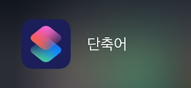
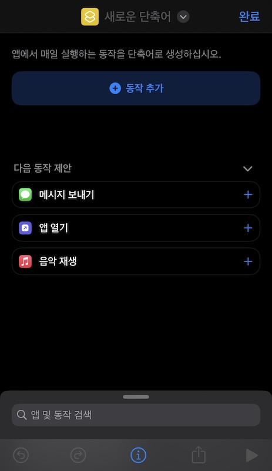
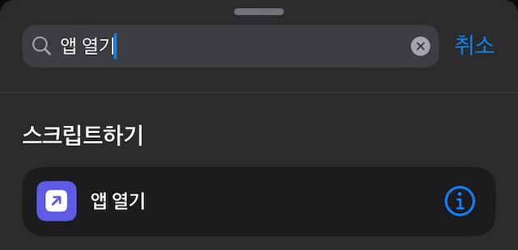
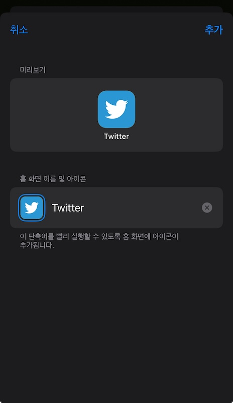

지난 7월 24일 X로 바뀌어 버린 트위터 로고를 단축어를 활용해서 다시 되돌리는 방법을 알아보겠습니다.

## 아이콘 되돌리기

먼저 iOS에 기본으로 내장되어 있는 단축어 앱을 실행해 주세요.

우측 상단의 `+` 버튼을 눌러 새로운 단축어를 생성해주세요.

`동작 추가` 버튼을 누른 뒤 `앱 열기` 항목을 선택해주세요.

X 앱을 선택해주세요.

마지막으로 하단 중앙의 정보 버튼을 누른 뒤 `홈 화면에 추가`를 선택해주세요.

아이콘과 이름을 트위터로 변경해주시면 됩니다.

이제 홈 화면에 있는 트위터 아이콘을 누르면 X 앱이 실행되는 것을 확인할 수 있습니다.

## 참고

만약 위 작업이 너무 귀찮으시다면 [이 링크](https://www.icloud.com/shortcuts/776c3b5795e347b8ae57b6a94a2be75f)를 통해 단축어를 다운로드 받을 수 있습니다.
