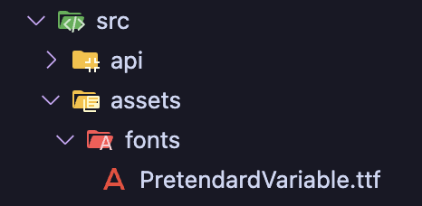
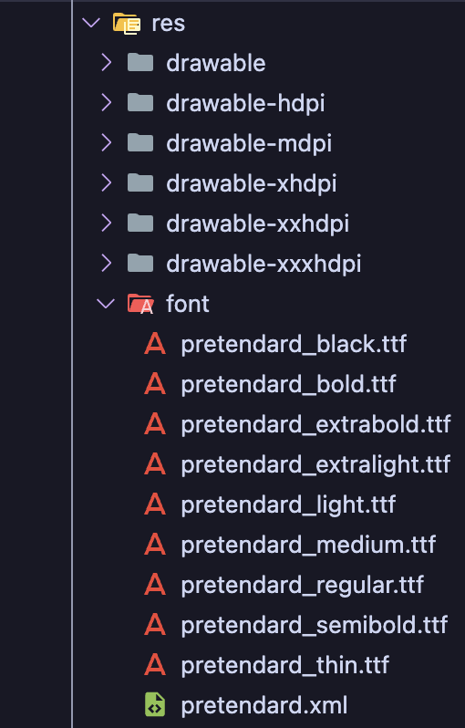

React Native는 기본적으로 iOS에서는 가변 폰트를 지원하지만, 안드로이드에서는 이를 직접적으로 지원하지 않습니다. 그동안 안드로이드에서 여러 굵기의 텍스트를 사용하려면, 굵기별로 각각의 폰트 파일을 fonts 폴더에 따로 넣어야 했고, fontWeight 옵션 대신 fontFamily를 사용하여 굵기를 변경해줘야 했습니다.

## 폰트 파일 추가



먼저 사용할 가변 폰트를 `src/assets/fonts` 폴더 안에 넣어줍니다.

## react-native.config.js 설정

프로젝트 루트 디렉터리에 `react-native.config.js` 파일을 생성한 후 다음과 같이 폰트 경로를 지정해줍니다.

```jsx
module.exports = {
  project: {
    ios: {},
    android: {},
  },
  assets: ['src/assets/fonts'],
};
```

이후 아래 명령어를 실행하여 폰트를 iOS 및 Android 프로젝트에 연결합니다.

```xml
npx react-native-asset
```

## Android XML 파일 생성



이제 안드로이드의 리소스 폴더에 폰트를 등록합니다. `android/app/src/main/res/font` 경로에 각 굵기별 폰트 파일들을 넣습니다.
그리고 해당 폰트들을 정의하는 XML 파일을 생성합니다. 예를 들어 Pretendard일 경우 파일을 다음과 같이 작성합니다.

```xml
<?xml version="1.0" encoding="utf-8"?>
<font-family xmlns:app="http://schemas.android.com/apk/res-auto">
    <font app:fontStyle="normal" app:fontWeight="100" app:font="@font/pretendard_thin"/>
    <font app:fontStyle="normal" app:fontWeight="200" app:font="@font/pretendard_extralight"/>
    <font app:fontStyle="normal" app:fontWeight="300" app:font="@font/pretendard_light"/>
    <font app:fontStyle="normal" app:fontWeight="400" app:font="@font/pretendard_regular"/>
    <font app:fontStyle="normal" app:fontWeight="500" app:font="@font/pretendard_medium"/>
    <font app:fontStyle="normal" app:fontWeight="600" app:font="@font/pretendard_semibold"/>
    <font app:fontStyle="normal" app:fontWeight="700" app:font="@font/pretendard_bold"/>
    <font app:fontStyle="normal" app:fontWeight="800" app:font="@font/pretendard_extrabold"/>
    <font app:fontStyle="normal" app:fontWeight="900" app:font="@font/pretendard_black"/>
</font-family>
```

`app:font` 속성에는 대문자나 띄어쓰기를 사용할 수 없습니다. 폰트 파일명은 모두 소문자와 언더바(\_)만 사용해야 하며, 알맞게 이름을 수정해 주어야 합니다.

## 빌드 후 확인

프로젝트를 다시 빌드한 뒤 확인해보면 Android에서도 iOS와 마찬가지로 가변 폰트가 적용된 것을 확인할 수 있습니다.
