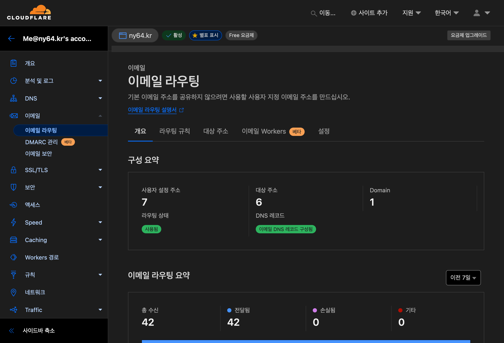

별도의 외부 메일 서버 구축 없이 자신의 도메인을 이메일 주소로 사용하는 방법을 알아보겠습니다.

Google Suite, Microsoft 365 등의 유료 서비스를 사용하지 않고, Cloudflare의 이메일 포워딩 기능을 사용하면 무료로 이메일을 라우팅 할 수 있습니다.

## Cloudflare에 도메인 추가하기

먼저 Cloudflare에 도메인을 추가해야 합니다.
이미 도메인이 추가되어 있다면 이 단계는 건너뛰어도 됩니다.

[Cloudflare 홈페이지](https://dash.cloudflare.com/)에 접속하여 로그인 한 뒤 우상단의 사이트 추가 버튼을 눌러 도메인을 추가합니다.

도메인 제공업체에서 네임서버를 Cloudflare의 네임서버로 변경합니다.

10분에서 30분정도 기다리면 네임서버 확인이 끝나고 도메인이 Cloudflare에 추가됩니다.

## 이메일 포워딩 설정하기

해당 도메인의 설정 페이지로 이동하여 좌측 이메일 메뉴를 클릭합니다.

저는 이미 설정이 되어있어 보이지 않지만, 하단에 레코드 추가 버튼을 눌러 DNS 레코드를 추가해줘야 합니다.

대상 주소 메뉴에서 포워딩 할 주소를 추가해줍니다.

그런 다음 라우팅 규칙 메뉴에서 주소 생성을 클릭하여 연결할 주소를 설정합니다.
대상 항목에는 앞서 추가한 Gmail 주소를 선택합니다.

메일을 한번 보내보면 설정한 `test@ny64.kr` 주소로 메일을 보냈을 때 Gmail로 잘 도착하는 것을 확인할 수 있습니다.

## 이메일 발신 설정하기

하지만 지금 이 상태로는 일방적으로 메일을 받을 수만 있고, 메일을 보낼 수는 없습니다.

## 앱 비밀번호 생성하기

먼저 Google 앱 비밀번호를 생성해야 합니다. [google.com/apppasswords](https://myaccount.google.com/apppasswords)에 접속하여 앱 비밀번호를 생성합니다.

2단계 인증이 활성화되어 있지 않다면 활성화를 해야 앱 비밀번호를 생성할 수 있습니다.

이 비밀번호는 한번만 표시되며, 외부로 유출될 경우 계정의 보안이 위험해 질 수 있으므로 주의해야 합니다.

## SMTP 설정하기

[Gmail 설정](https://mail.google.com/mail/u/0/#settings/accounts) 페이지로 이동하여 SMTP 설정을 해줍니다.

사진과 같이 이름과 이메일 주소를 앞서 설정한 주소로 입력합니다.

SMTP 서버에는 `smtp.gmail.com`

사용자 이름에는 구글 아이디 _(xxxx@gmail.com일 경우 xxxx)_

비밀번호에는 앞서 발급한 앱 비밀번호를 입력합니다.

해당 메일 주소로 온 승인 이메일의 URL을 클릭하여 승인을 완료하면 설정이 완료됩니다.

## 기본 발신 주소 설정하기

이제 Gmail에서 메일을 보낼 때 이메일 주소를 선택할 수 있습니다.

[Gmail 설정](https://mail.google.com/mail/u/0/#settings/accounts) 페이지로 이동하여 기본으로 설정을 클릭하면 앞으로는 기본값이 변경됩니다.

